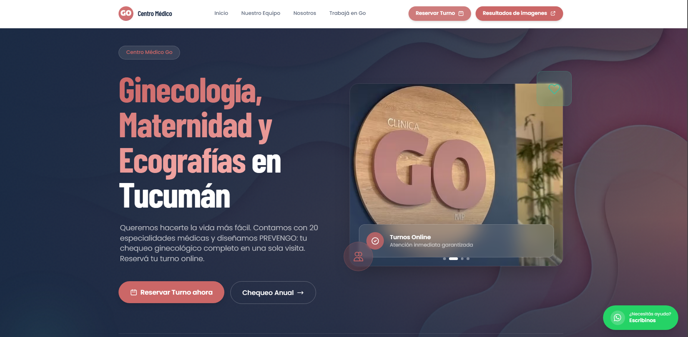
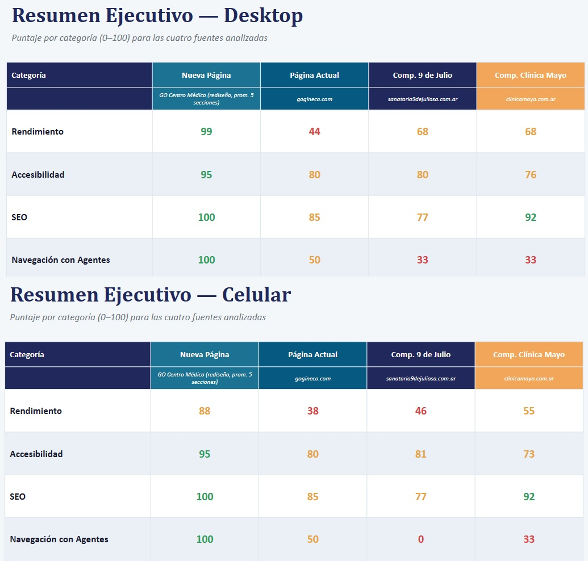

# GO Centro Médico

Sitio institucional para un centro médico especializado en salud de la mujer, con más de 60 profesionales y crecimiento constante. Construido con Astro y Sanity para que el equipo administre médicos, especialidades y contenidos sin depender de un desarrollador.

**[Ver sitio](https://www.gogineco.com)**



---

## El problema

GO es un centro médico de San Miguel de Tucumán centrado en la salud de la mujer. Tiene más de 60 profesionales y está en expansión permanente.

Su sitio anterior era un WordPress que había quedado viejo: lento, difícil de mantener y que no representaba a la institución. Pero el problema de fondo no era estético, era operativo.

**La rotación de profesionales.** Con más de 60 médicos de distintas especialidades que entran y salen, la cartilla cambia seguido. En el esquema anterior, cada alta o baja era un pedido a un desarrollador. El resultado previsible: la web mostraba médicos que ya no atendían y no mostraba a los que sí. Para un centro de salud, esa desactualización no es un detalle de mantenimiento, es una paciente que llega a una consulta que no existe.

**La solicitud de turnos.** Los pacientes tenían que llamar por teléfono para todo. El sitio tenía que poder resolver la reserva.

**El rendimiento.** La mayoría de las pacientes entra desde el celular, muchas veces con conexión móvil. Un sitio que tarda es una consulta que se pierde.

## La propuesta

Astro con Sanity como CMS headless. La lógica de la elección:

- **Astro** genera HTML estático en el build. La paciente recibe páginas prácticamente sin JavaScript: cargan rápido incluso con mala señal, y los buscadores las indexan sin fricción.
- **Sanity** desacopla el contenido del código. El equipo del centro entra al panel, agrega un médico con su especialidad y su foto, y el sitio se actualiza. Sin tickets, sin esperas, sin costos por cada cambio.
- Al no haber servidor de aplicaciones ni base de datos expuesta, **la superficie de ataque se reduce drásticamente** frente a un WordPress con plugins — un punto que importa en el rubro salud.

## Qué hace

- **Cartilla de profesionales** administrable desde el CMS: alta, baja y edición de médicos y especialidades por el propio equipo del centro.
- **Solicitud de turnos**: Los perfiles medicos tienen una estructura que les permite redireccionar a cualquier gestor de agenda externa que el doctor use para gestionar sus turnos o incluso redireccionarlo a whatsapp personal. 
- **Presentación institucional**: servicios, especialidades y contenidos del centro.
- **Modelado de contenido a medida** en `sanity.config.ts`, según lo que el centro necesita cargar.
- **SEO técnico**: SEO técnico realizado completo, con elementos básicos como sistemas, metadatos, etc a implementaciones mas avanzadas como Open Graph, Schemas, google analytics, uso de herramientas como ubersuggest para la investigación de palabras clave en el contenido, entre otras. Aplicado a cada pagina del centro medico, incluyendo perfiles.   
- **Diseño responsive**, priorizando Mobile.

## Resultados

Auditoría con Lighthouse / PageSpeed Insights. Los valores de la nueva página son el promedio de 5 secciones; se incluyen dos competidores locales como referencia.

| | **Nueva página** | Sitio anterior<br>(gogineco.com) | Sanatorio 9 de Julio | Clínica Mayo |
|---|---|---|---|---|
| **Rendimiento** | **99** | 44 | 68 | 68 |
| **Accesibilidad** | **95** | 80 | 80 | 76 |
| **SEO** | **100** | 85 | 77 | 92 |
| **Navegación con agentes** | **100** | 50 | 33 | 33 |



El salto de rendimiento —de 44 a 99— es la diferencia entre un sitio que hace esperar y uno que responde de inmediato. La comparación con los otros centros de la ciudad muestra que no se trata solo de mejorar respecto del punto de partida: el sitio queda por encima del estándar del rubro en la plaza local.

## Stack y por qué

| Tecnología | Rol | Por qué esta |
|---|---|---|
| Astro | Framework | Sitio de contenido con poca interactividad. Generar HTML estático da el mejor rendimiento posible y el mejor punto de partida para posicionamiento. |
| Sanity.io | CMS headless | Permite modelar la cartilla médica a medida y que la administren personas no técnicas, sin acoplar el CMS a la capa visual. |
| TypeScript | Tipado | Tipado sobre las consultas al CMS: si cambia un esquema, el error aparece en el build y no en producción. |
| Tailwind CSS | Estilos | — |
| Vercel | Deploy | Despliegue continuo desde `main`. |

## Estructura

```
src/                 Páginas, componentes y layouts de Astro
sanity.config.ts     Configuración y esquemas de contenido del CMS
public/              Estáticos e imágenes
astro.config.mjs     Configuración de Astro
```

## Correrlo localmente

```bash
git clone https://github.com/JuanCarriles/Gogineco.git
cd Gogineco
npm install
cp .env.example .env   # completar con las credenciales de Sanity
npm run dev
```

Abrir http://localhost:4321

### Variables de entorno

| Variable | Para qué |
|---|---|
| `PUBLIC_SANITY_PROJECT_ID` | ID del proyecto en Sanity |
| `PUBLIC_SANITY_DATASET` | Dataset a consultar | 
| `RESEND_API_KEY` | API para el envió de mails vía Resend |


## Decisiones técnicas

### CMS headless en lugar de otro WordPress

La opción evidente era rehacer el WordPress. Se descartó por tres motivos: el rendimiento arranca lastrado por el peso de la plataforma y sus plugins; cada plugin es una dependencia que hay que actualizar y una vía de entrada potencial, algo que en salud pesa distinto; y el contenido queda atado a la capa visual, así que un rediseño futuro implica volver a empezar.

Con Sanity, el contenido vive en su propio servicio y con su propio modelo. Si dentro de tres años el centro quiere otro diseño, se rehace el front y la cartilla sigue intacta.

### Estático sobre dinámico

Un centro médico actualiza contenido varias veces por semana, no varias veces por segundo. Generar las páginas en el build en lugar de renderizarlas en cada request elimina el servidor de la ecuación: menos latencia, menos costo de infraestructura y menos cosas que pueden fallar un domingo.

### Modelado del contenido

Cada pagina cuenta con su propia categoría para modificar desde la plataforma SANITY. A su vez, las especialidades y los doctores tienen sus schemas donde un doctor puede poseer una o mas especialidades.

## Estado

Pagina en producción.

---

Desarrollado por [Juan M. Carriles](https://www.linkedin.com/in/juan-maria-carriles-8836512a2/) · juanmcarrile@gmail.com
